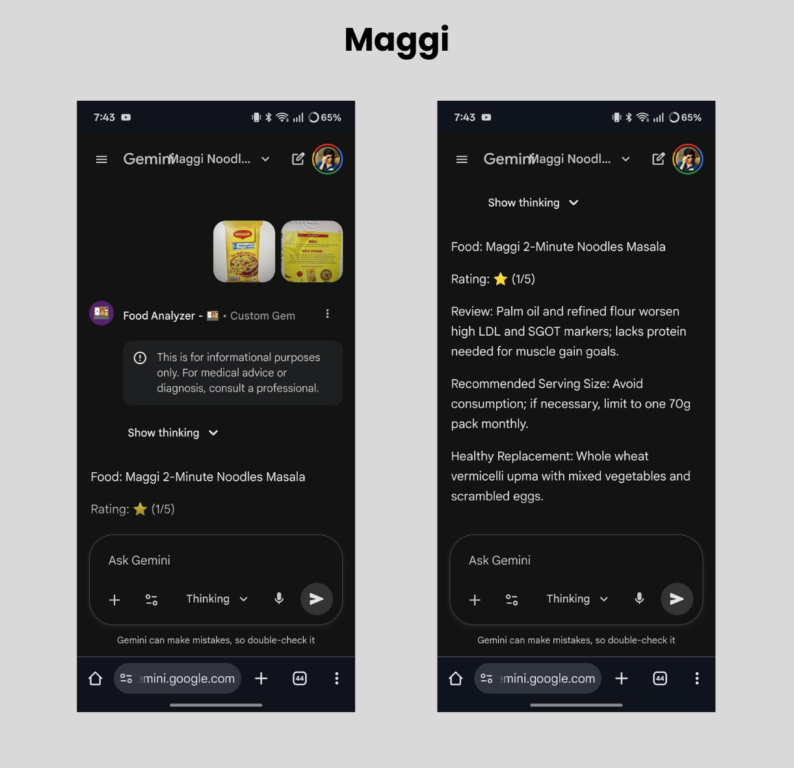
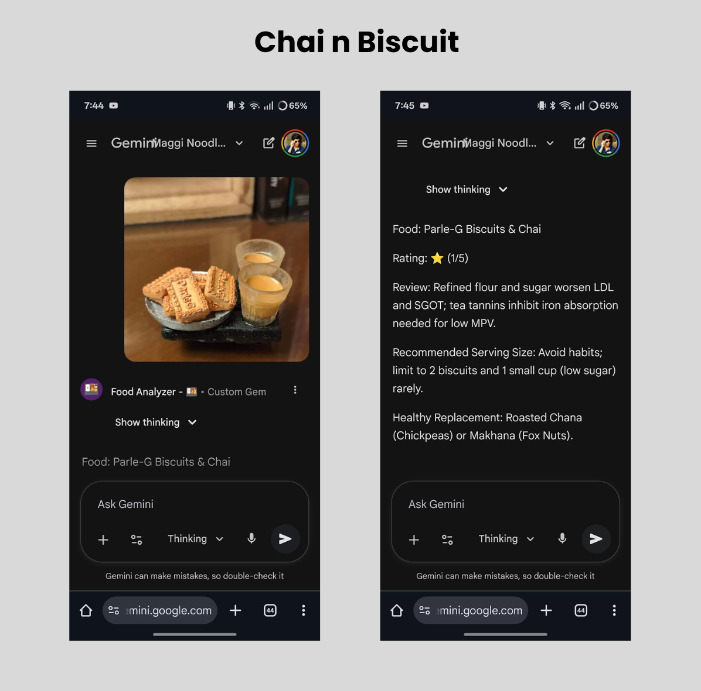
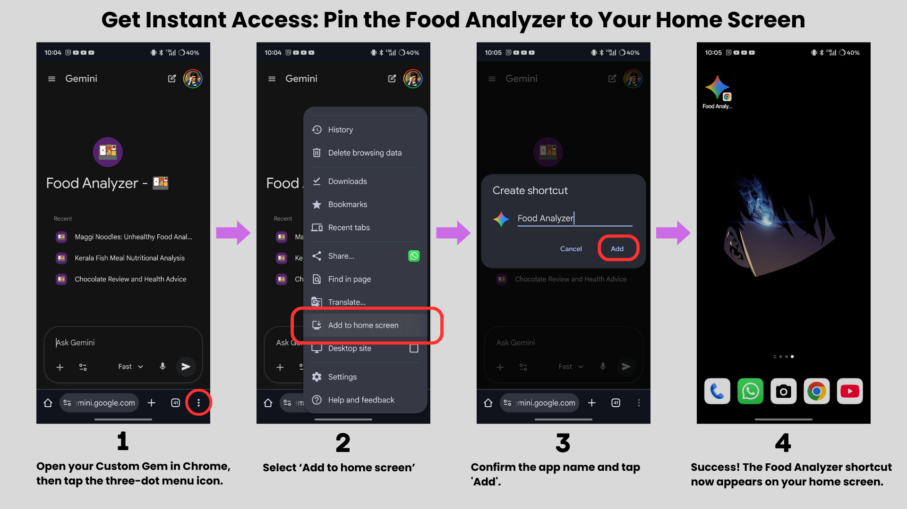

# 🩺 Personalized Food Analyzer AI (Powered by Google Gemini Gems)

> **Stop guessing. Start knowing.** Turn generic nutrition advice into hyper-personalized health intelligence using your own biomarkers.

## 🧐 What is this?

Most nutrition apps are fundamentally broken because they treat everyone the same. They tell you a protein bar is "healthy" because it has protein, ignoring the fact that it might spike your pre-diabetic blood sugar or contains allergens that inflame your gut.

**Food Analyzer AI** is different. It's a blueprint for creating your own private, hyper-personalized nutrition assistant using Google Gemini's "Custom Gems."

By feeding the AI your specific context—blood test results (e.g., High LDL, Low Vitamin D), activity level, allergies, and goals—it creates a strict dietary engine that analyzes food *only* for you. It cuts through marketing hype and tells you the cold, hard truth about what's on your plate.

### Key Features

* **🩸 Biomarker-Driven Analysis:** Ratings are based on *your* labs (e.g., cholesterol, liver enzymes, vitamin deficiencies), not general guidelines.
* **🛡️ Safety First:** Automatic "1-Star" instant rejection for foods containing your specific allergens or medication interactions.
* **🚫 Anti-Marketing Defense:** Sees through "Healthy," "Diet," or "Baked" labels to expose hidden sugars, refined carbs, and inflammatory oils.
* **🔄 Smart Replacements:** If a food is rated poorly (≤2 stars), it suggests a culturally relevant, healthier alternative.
* **⚖️ Personalized Portions:** Serving sizes calculated based on your height, weight, and activity level.
* **📱 Native Mobile Experience:** Runs quickly and freely on your phone via the Gemini app.

---

## 📸 Visual Proof: The Engine in Action

Here is how the AI analyzes popular snacks for a user with **High LDL Cholesterol, Liver stress (SGOT), and Vitamin Deficiencies**, targeting an Indian context.

| The "2-Minute" Trap | The "Comfort" Drink | The Street Food King |
| :---: | :---: | :---: |
|  |  |  |
| **Rating: ⭐ (1/5)** Refined carbs and unhealthy fats aggressively target already high LDL and stressed liver. | **Rating: ⭐⭐ (2/5)** Sugar spikes insulin; tannins block iron absorption needed for low ferritin levels. | **Rating: ⭐ (1/5)** Deep-fried preparation is catastrophic for cholesterol goals and liver inflammation. |

---

## 🚀 Setup Guide: Create Your Personal Gem

You need a Google account with access to Gemini Advanced to create Custom Gems.

### Step 1: Generate Your Data Profile

The AI needs to know who you are before it can advise you. We use a specialized prompt to convert your messy health data into a clean configuration block.

1.  Gather your data: Recent blood work PDFs, current weight/height, supplements stack, and goals.
2.  Open a standard chat with [Google Gemini](https://gemini.google.com/).
3.  Copy and paste the entire content of the **Profile Generator Prompt**:
    > 📄 **[Link to prompts/01_profile_generator.md](prompts/01_profile_generator.md)**
4.  Reply to Gemini with your health dump.
5.  **Crucial:** Copy the final code block output it generates. You will need this for Step 2.

### Step 2: Configure the Food Analyzer Gem

1.  Go to Gemini and navigate to **Gem Manager** -> **New Gem**.
2.  **Name:** Give it a name like "My Health Scanner".
3.  **Instructions:** Copy and paste the entire content of the **Food Analyzer Prompt**:
    > 📄 **[Link to prompts/02_food_analyzer.md](prompts/02_food_analyzer.md)**
4.  **THE VITAL STEP:** In the Gem instructions box, scroll down to the section labeled:
    `# [INSTRUCTION FOR USER: PASTE THE OUTPUT FROM 'STEP 1: PROFILE GENERATOR' BELOW]`
    Delete that bracketed line and paste your personalized data block from Step 1 right there.
5.  Click **Create**.

---

## 💡 Pro-Tips for Best Results

Once your Gem is running, how you talk to it matters.

### 1. Context is King
The AI can analyze images, but text provides crucial context. A "Biryani" from a fast-food chain is nutritionally different from a "Homemade Biryani with less oil and extra lean chicken."

* **Good input:** *Sends photo of a burger*
* **Better input:** "Restaurant beef burger, ate half the bun."
* **Best input:** "Homemade chicken curry, minimal oil, one small bowl with rice."

### 2. Use the "Thinking" Model
For the most accurate, nuanced medical-grade analysis, ensure your Gemini is set to use the **Gemini 1.5 Pro (Thinking)** model, if available to you. It reasons deeper about nutrient interactions.

### 3. The "Quick Launch" Hack (Android Chrome)
Don't open the Gemini app and navigate menus every time you eat. Pin your custom Gem directly to your home screen for instant access.

  

---

## ⚠️ Disclaimer

**This tool is for informational purposes only.** The analysis provided by this AI is based on the data you provide and general nutritional knowledge. It is **not** a substitute for professional medical advice, diagnosis, or treatment. Always seek the advice of your physician or qualified health provider with any questions regarding a medical condition. Never disregard professional medical advice or delay in seeking it because of something you have read on this application.